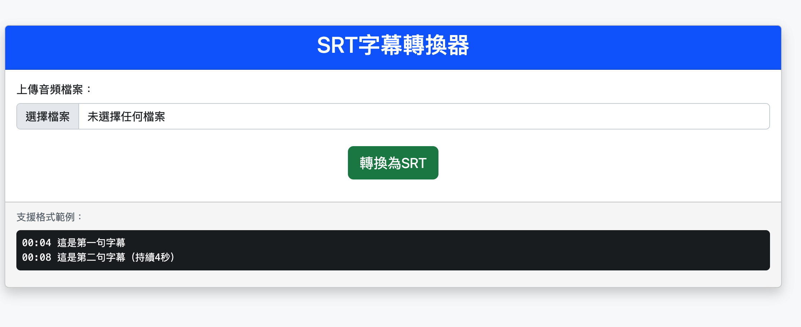
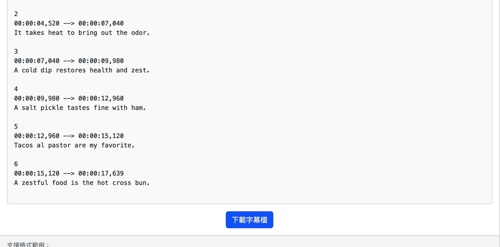

# SRT 字幕轉換器

## 截圖

以下是應用程式的兩個截圖：




## 主要功能

- 支援上傳 MP3、WAV、M4A 格式的音頻檔。
- 自動將音頻切割成多個片段。
- 使用 OpenAI Whisper API 進行語音轉錄。
- 將轉錄結果整合並轉換成標準的 SRT 字幕格式。
- 前端頁面提供即時處理進度顯示。

## 如何安裝

1. 安裝 Python 3.x。
2. 安裝必要套件：

   ```
   pip install -r requirements.txt
   ```

3. 確保設定環境變數 `OPENAI_API_KEY`：
   - Windows:

     ```
     set OPENAI_API_KEY=your_api_key
     ```

   - macOS/Linux:

     ```
     export OPENAI_API_KEY=your_api_key
     ```

## 如何執行

1. 啟動 Flask 應用：

   ```
   python app.py
   ```

2. 在瀏覽器中造訪 `http://localhost:5000`，上傳音頻檔並進行轉換。
